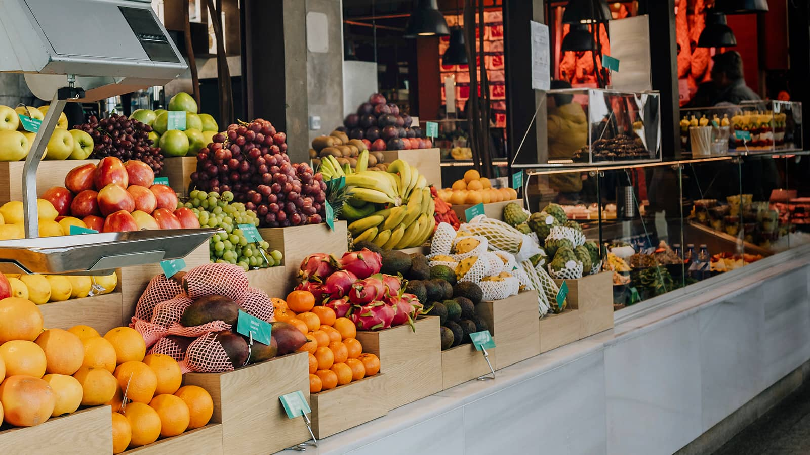
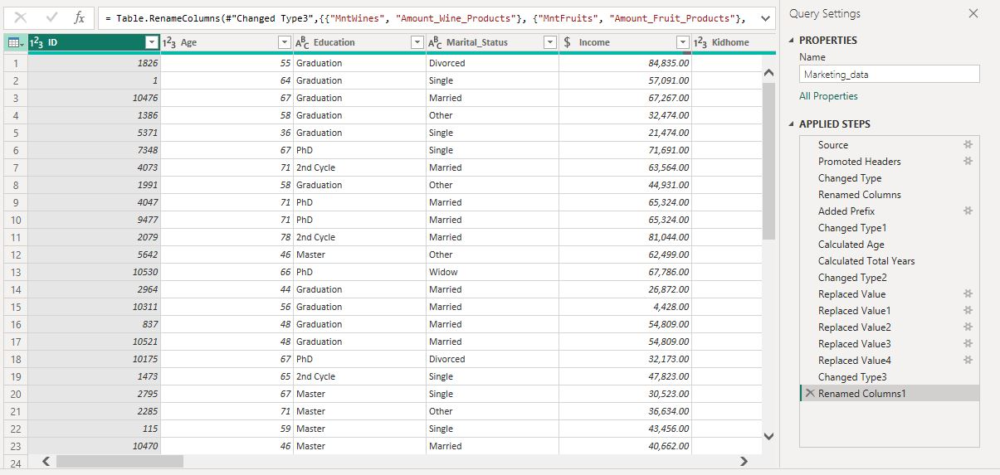
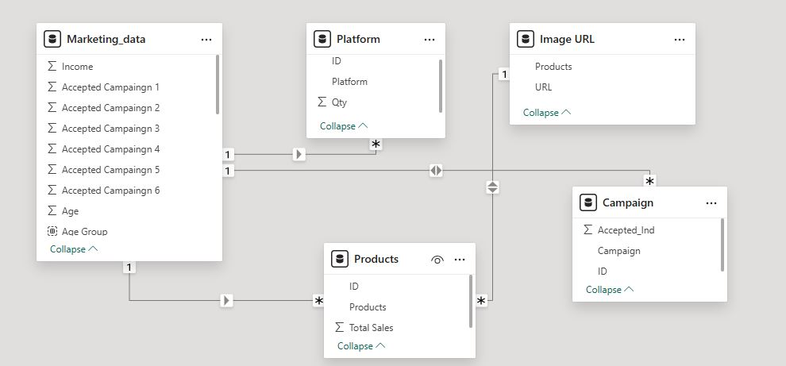
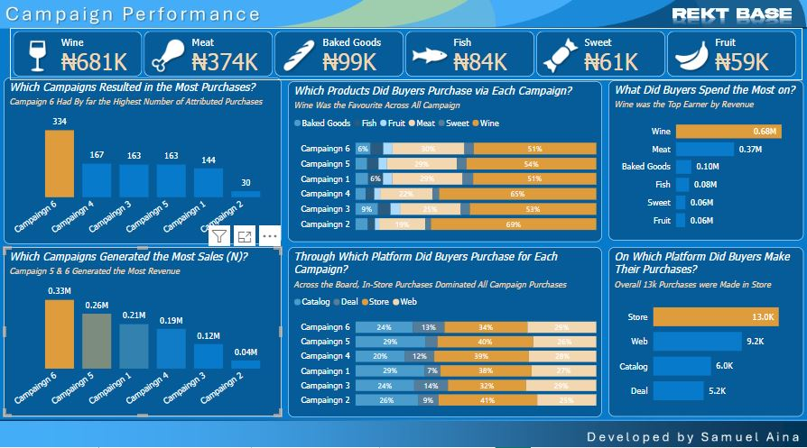
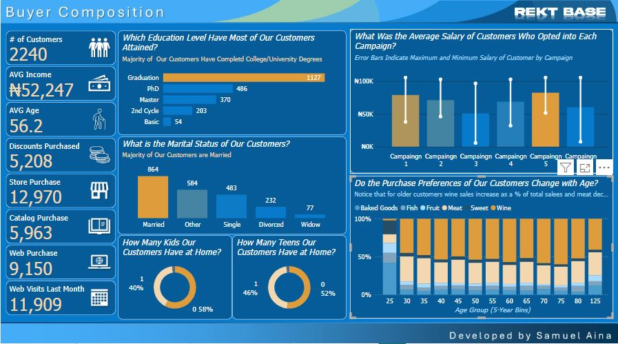
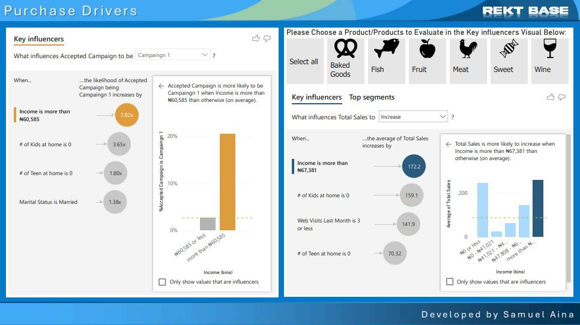

# Optimizing-Retail-Sales-with-BI

## Introduction
In this project, I worked as a **Business Intelligence (BI) Developer** for **Rekt Base**, a market research firm collaborating with a retail vendor specializing in **food and beverage products**. The client, a **small company**, aimed to better understand their market, customers, and the performance of their recent **marketing campaigns**. My objective was to build a **BI tool** that provides insights into key areas of interest, including **campaign performance, product sales, customer demographics, and purchase drivers**.

---

## Skills and Concepts Demonstrated
- **Data Cleaning and Transformation**
- **Data Modeling**
- **Business Intelligence Reporting**
- **Data Visualization**
- **Dashboard Development**
- **Customer and Market Analysis**

---

## Problem Statement
The client needed a **comprehensive analysis** of their **marketing and sales data** to answer the following questions:
- **How are our six recent marketing campaigns performing?**
- **How are our products performing?**
- **Who are our customers?**
- **What factors drive campaign performance and buyer decision-making?**

To address these concerns, I developed a **Power BI solution** that includes **dashboards and reports** highlighting **marketing effectiveness, customer segmentation, and purchase drivers**.

---

## Data Cleaning

To ensure the dataset was accurate and structured correctly, the following data cleaning steps were performed:
- **Promoted Headers**
  - Ensured that column names were correctly assigned by promoting headers.
- **Converted Years to Age**
  - Added a **prefix** to the year column and converted it to age.
  - Calculated **total years** to get the accurate age representation.
- **Fixed Inconsistent Categorical Data**
  - **Education Column:** Corrected incorrect values such as `"2n Cycle"` to `"2nd Cycle"`.
  - **Marital Status Column:** Reclassified inconsistent values:`"YOLO"`, `"together"`, `"alone"` → **Grouped into** `"Single"` and `"Others"`.
- **Standardized Income Data**
  - Changed **Income** data type to **fixed decimal** for accurate currency representation instead of whole numbers.
- **Renamed Columns for Clarity**
  - Adjusted ambiguous column names to ensure **better readability** and **accurate meaning**.

These steps ensured that the dataset was clean, structured, and ready for analysis in Power BI.

## Data Modeling

To ensure an **optimized data structure**, I created a **relational data model**:
- The **main dataset** was referenced to create **separate tables** for **campaigns, products, and platforms**.
- The **primary key (ID)** in the **main dataset** was linked to corresponding **foreign keys** in the created tables.
- A **one-to-many relationship** was established between the **main dataset** and **related tables**.
- The **campaign table relationship** was set to **Both** in the **cross-filter direction** to improve data accuracy.

---

## Visualizations

### **Campaign Performance Dashboard**

- **Campaign 6** had the highest number of attributed purchases (**334**), followed by **Campaign 4** and **Campaign 3** (**167 and 163**, respectively).
- **Campaigns 5 and 6** generated the **most revenue**, with **₦0.33M** and **₦0.26M**, respectively.
- **Wine** was the **most purchased product** across all campaigns, followed by **meat** and **baked goods**.
- **Wine** was the **highest-earning product**, generating **₦0.68M** in revenue, followed by **meat** (**₦0.37M**) and **baked goods** (**₦0.10M**).
- **In-store purchases** dominated all campaigns, with **13K** purchases made **in-store**, followed by **9.2K** via **web**, **6K** via **catalog**, and **5.2K** through **deals**.

### **Buyers Composition Report**

- Most customers had a **college/university degree** (**1,127**), followed by **PhD holders** (**486**) and **master's degree holders** (**370**).
- Majority of customers were **married** (**864**), followed by **single** (**483**).
- **58%** of customers had **no kids**, while **40%** had **one child**.
- **52%** of customers had **no teens at home**, while **46%** had **one teen**.
- Customers with **higher incomes** (**above ₦60,585**) were **7.82 times more likely** to accept **Campaign 1**.
- Older customers tended to purchase **more wine** as a percentage of total sales.

### **Purchase Drivers Report**

- **Income above ₦67,381**, having **no kids at home**, and **fewer web visits** were strong predictors of **total sales increase**.
- Customers with **higher incomes** and **no children** were **more likely** to increase total sales.
- The likelihood of accepting **Campaign 1** was **higher** among customers with **income above ₦60,585**, **no kids**, and being **married**.
- **A button slicer** was added for **product evaluation** in the **Key Influencers visual**.

---

## Analysis
Key insights derived from the dashboards and reports include:
- **Campaigns 5 and 6** were the **most successful** in generating sales.
- **Wine** was the **most preferred product** across all campaigns.
- **Most purchases** were made **in-store**, reinforcing the need for **in-store promotional strategies**.
- **High-income earners** and **married customers** were **more likely** to opt into marketing campaigns.
- **Purchase habits** varied with **age**, as **older customers** had a **higher preference for wine**.

---

## Conclusion and Recommendations
Based on the analysis, the following recommendations were made to the client:
- **Focus marketing efforts** on **high-performing campaigns (5 and 6)** and refine lower-performing ones.
- **Prioritize in-store promotions** since the majority of purchases happen there.
- **Use personalized marketing strategies** to target **high-income and married customers**.
- **Leverage insights** on **product preference by age group** to optimize inventory and sales strategies.

This project successfully demonstrated how **BI tools** can transform **raw data** into **meaningful insights**, helping businesses **make informed decisions** to **drive growth and customer satisfaction**.
